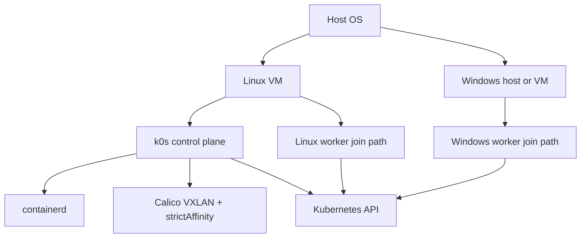

# Local Kubernetes (Linux + Windows) with k0s + Calico

## Purpose and Scope

This repository provides a deterministic, script-driven setup for a local Kubernetes environment with:

- [k0s](https://k0sproject.io/) control plane
- [containerd](https://containerd.io/) runtime
- [Calico](https://projectcalico.docs.tigera.io/) networking configured for mixed-OS compatibility
- Linux node participation now, Windows worker flow planned

Primary intent:

- provide a local development cluster with AKS-hybrid-like capabilities
- handle hybrid Linux/Windows cluster complexity through a repeatable workflow
- reduce cluster bring-up complexity as a developer productivity hurdle

This project is not intended for production deployment.

---

## High Target Architecture

The architecture is documented at a high level for operator understanding.



Conceptual boundaries to keep in mind:

- host OS layer and guest VM layer
- internal virtual switching path between nodes
- per-node containerd runtime instances
- control-plane first, then node join sequence

---

## Why This Architecture Looks This Way

Some design choices are intentional guardrails to keep the hybrid cluster stable and developer-friendly:

- **Control plane is not hosted in WSL2**: WSL2 networking can reset in ways that destabilize long-running Kubernetes control-plane behavior.
- **Linux and Windows workloads use isolated runtime environments**: Linux and Windows containers do not share one containerd runtime instance; isolation through Hyper-V boundaries avoids cross-OS runtime conflicts.
- **Dedicated Linux VM for cluster core**: control plane and cluster workloads are separated from day-to-day developer tooling/config drift on the Linux development side.
- **WSL2 remains fully available for Linux development**: developers can customize WSL2 freely without coupling changes to cluster control-plane stability.
- **Windows host remains fully available for Windows development**: local developer workflows on Windows are kept independent from cluster lifecycle concerns.

Implementation notes such as whether runtime sharing is viable in specific future scenarios are treated as evolving details and tracked in scripts or implementation notes, not as hard README guarantees.

---

## Script Structure and Usage

### Repository Structure

```text
config/
  k0s.yaml
  calico.yaml
  calico-ippool.yaml
  calico-ipam.yaml

01-prereqs.sh
02-cluster.sh
03-network.sh
04-controller-token.sh
05-linux-node.sh
06-windows-node.ps1
10-nginx.sh
20-validate.sh
99-cleanup.sh
```

### Stage Responsibilities

- [`01-prereqs.sh`](01-prereqs.sh): install/ensure base dependencies (containerd, CNI plugins, k0s, image pre-pull)
- [`02-cluster.sh`](02-cluster.sh): install and start control plane only
- [`03-network.sh`](03-network.sh): apply Calico and related IPPool/IPAM config
- [`04-controller-token.sh`](04-controller-token.sh): generate shared worker join token artifact (`./artifacts/k0s-worker-token`) for Linux/Windows worker stages, then auto-join local Linux worker by default
- [`05-linux-node.sh`](05-linux-node.sh): Linux worker join/install script (default token path `./artifacts/k0s-worker-token`); supports same-VM dual-service mode when explicitly allowed by caller
- [`06-windows-node.ps1`](06-windows-node.ps1): Windows worker stage scaffold that consumes the same shared token artifact path
- [`10-nginx.sh`](10-nginx.sh): basic smoke deployment/connectivity check
- [`20-validate.sh`](20-validate.sh): broad state diagnostics snapshot
- [`99-cleanup.sh`](99-cleanup.sh): destructive cleanup/reset of local cluster state

### Standard Rebuild Workflow

Run stages sequentially by numeric filename order.

```bash
./99-cleanup.sh
sudo reboot

./01-prereqs.sh
./02-cluster.sh
./03-network.sh
./04-controller-token.sh
# optional: run manually only when AUTO_JOIN_LOCAL_WORKER=false
# ./05-linux-node.sh
# optional/parallel worker path scaffold
# ./06-windows-node.ps1
./10-nginx.sh
./20-validate.sh
```

By default, [`04-controller-token.sh`](04-controller-token.sh) performs local same-VM Linux worker join and passes `ALLOW_SAME_HOST_WORKER=true` into [`05-linux-node.sh`](05-linux-node.sh).

If you want separate-host worker onboarding, opt out with `AUTO_JOIN_LOCAL_WORKER=false`:

```bash
AUTO_JOIN_LOCAL_WORKER=false ./04-controller-token.sh
```

Then transfer `./artifacts/k0s-worker-token` and run [`05-linux-node.sh`](05-linux-node.sh) on the separate Linux worker host.

For Windows worker onboarding, place the same token at the expected path and run [`06-windows-node.ps1`](06-windows-node.ps1).

Windows worker onboarding is currently a scaffold and should be expanded before production use.

### Environment Hygiene During Iterative Testing

During script development and repeated test runs, environment contamination can occur.

- treat unexpected behavior as possible state contamination
- if contamination is suspected, run [`99-cleanup.sh`](99-cleanup.sh) then reboot
- after reboot, rebuild sequentially in numeric order
- this cycle is expected, especially after Kubernetes networking changes

### Logging Recommendation

To keep console output clean while preserving diagnostics:

- write full per-run logs to `logs/<script-name>-<timestamp>.log`
- print only high-signal progress lines to console
- keep detailed command output in log files for post-run analysis

---

## Technical Details and Considerations

Only the details that directly affect operator decisions are captured here. Deeper implementation specifics belong in script headers.

### Networking Is a Rebuild Boundary

Network model changes are treated as rebuild-triggering operations. In practice, changing Calico mode/IPAM behavior should assume cleanup + reboot + sequential rebuild.

### Determinism and Idempotency

Scripts are designed to be re-runnable at their stage boundary so you can iteratively improve and test. Idempotency is a core requirement for this workflow.

### State Location Awareness

Cluster/runtime state under paths such as `/var/lib/k0s`, `/var/lib/kubelet`, `/var/lib/cni`, and runtime mounts/processes can leak across failed runs; this is why [`99-cleanup.sh`](99-cleanup.sh) is part of normal operator workflow.

### Current Implementation Status

- Linux control-plane and Linux worker path are implemented in shell scripts.
- Windows worker automation scaffold exists as [`06-windows-node.ps1`](06-windows-node.ps1) and currently validates shared token input only.

---

## Scope Reminder

This repository is for building and operating a local-development Kubernetes cluster that mirrors key AKS hybrid behaviors, using explicit operator-driven stages. It is intentionally optimized to make hybrid cluster setup predictable and less burdensome for developers.
